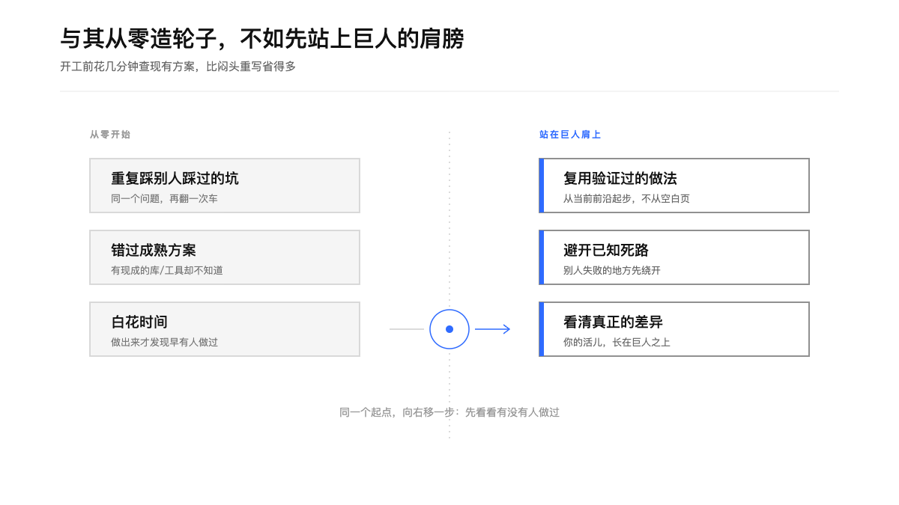
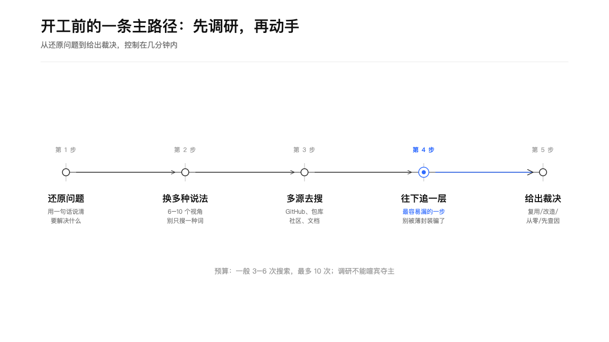
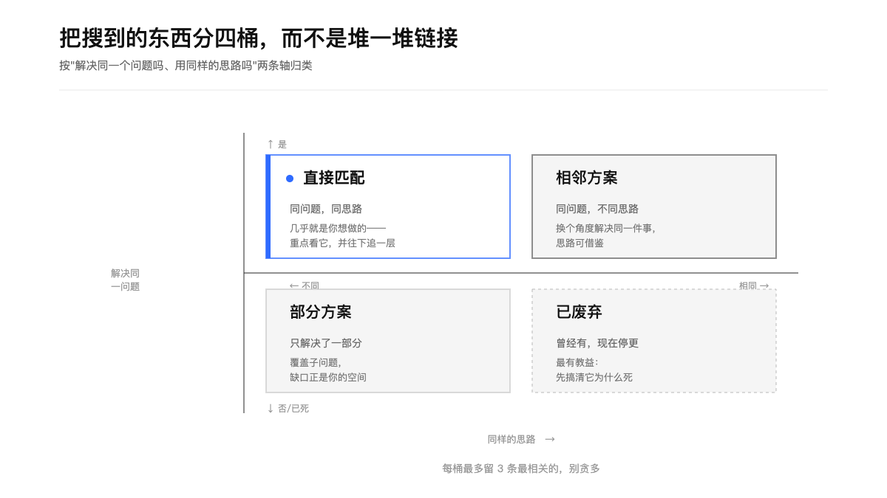
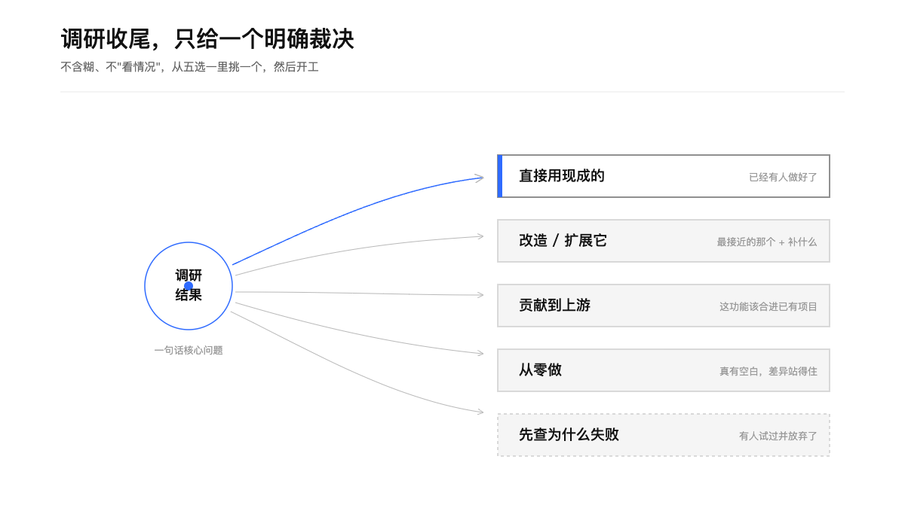
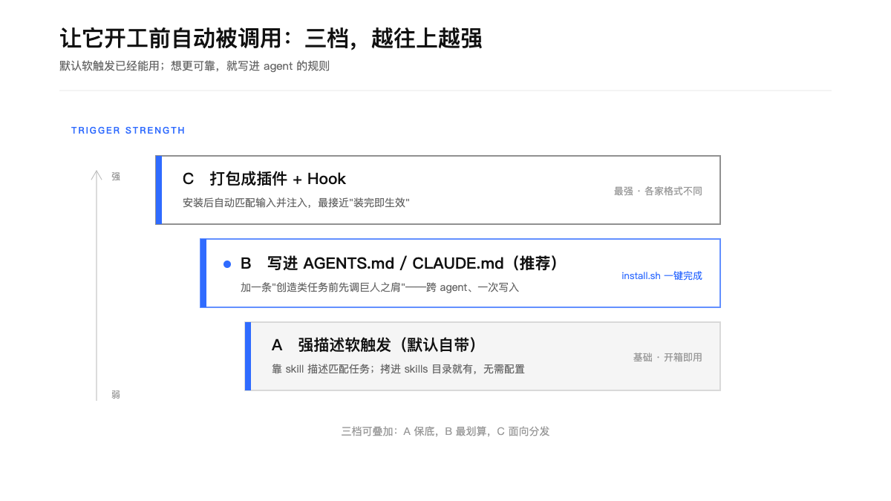

> “If I have seen further it is by standing on the shoulders of Giants.” — Isaac Newton, 1675

<div align="center">

### *"If I have seen further it is by standing on the shoulders of Giants."*

**"如果说我看得更远，那是因为我站在巨人的肩膀上。"**

— Isaac Newton, 1675

<br>

*知识不是从零生长的，它长在前人之上。*
*每一次创造，都始于先看清脚下已经垒起了多高。*

</div>

---

# 巨人之肩 · Giants' Shoulders

<p align="center">
  
  
  
</p>

一个给 AI agent 用的 **skill**：在开始任何"从零造东西"的任务前，先上网查一遍——**有没有人做过类似的事？能借鉴什么？和你要做的差在哪？** 然后再动手。

适用于任何能联网搜索的 agent：Claude Code、Codex、Cursor、TRAE 等。

## Agent 使用契约（运行前必读）

这是创造类任务的首步调研 Skill。Agent 先把用户要解决的问题写成一句话，再用多组搜索词查公开先例，最后给出一个裁决并继续后续工作。

| 项目 | 规则 |
| --- | --- |
| 触发 | 建工具、脚本、库、CLI、Skill、插件、Agent、工作流、集成、原型或产品；设计架构和技术选型 |
| 首步 | 重述问题与目标动作；随后使用宿主提供的搜索能力，不先写代码 |
| 输入 | 用户目标、约束、候选技术、受众和预期交付 |
| 输出 | 直接匹配、相邻方案、部分方案、已废弃四桶；每桶最多 3 条，并给出一个明确裁决 |
| 证据 | 每个保留方案附官方链接、许可证、维护状态和与当前任务的差异 |
| 范围 | 控制在约 3–6 次搜索；“未找到可验证先例”可以作为结论 |
| 写入 | 调研阶段只读外部信息，不修改项目文件；安装脚本需要用户明确同意后才改配置 |
| 降级 | 搜索能力不可用时说明无法完成先例扫描，不把记忆或弱匹配写成事实 |

完成调研后必须继续原任务，除非用户要求先停在方案比较阶段。

---

## 为什么需要它

大多数想法都有人试过了：有的做得好，有的做得糟，有的因为踩了坑而放弃，只有少数是真正的空白。**闷头从零开始，往往是在重复别人已经走过的路**——重复踩坑、错过成熟方案、做到一半才发现早有人做过。

"巨人之肩"不是让你抄，而是让你**从当前前沿起步，而不是从一张白纸起步**：复用验证过的做法，绕开已知的死路，然后把精力花在真正属于你的那部分差异上。

<p align="center"></p>

---

## 它做什么

触发后，它跑一条固定的"开工前调研"主路径，控制在几分钟内：

<p align="center"></p>

1. **还原问题** —— 用一句话说清你到底要解决什么（是问题本身，不是你选的方案）。
2. **换多种说法** —— 同一个问题写出 6–10 个不同视角的说法（使用者视角、学术视角、底层实现、隔壁学科…），避免所有搜索词都撞进同一个语义簇。
3. **多源去搜** —— 不只通用搜索，还去 GitHub、包管理器（npm / PyPI / crates.io…）、技术社区、官方文档。
4. **往下追一层** —— 最容易漏的一步：你搜到的项目常常只是薄封装，它文档里"built on X / wraps Y"提到的那个，才是真正的巨人。
5. **给出裁决** —— 归类、对比，最后给一个明确结论，然后开工。

### 把搜到的分四桶，而不是堆一堆链接

<p align="center"></p>

按"是否解决同一个问题、是否用同样的思路"两条轴，把结果分成**直接匹配 / 相邻方案 / 部分方案 / 已废弃**四类。每桶最多留 3 条最相关的。其中"已废弃"往往最有教益——先搞清它为什么死。

### 只给一个明确裁决

<p align="center"></p>

不含糊、不"看情况"。从五个里挑一个，附一句理由和下一步：

| 裁决 | 什么时候 |
|---|---|
| **直接用现成的** | 已经有人做得很好，点名最佳选项 |
| **改造 / 扩展** | 最接近的项目 + 具体补什么 |
| **贡献到上游** | 这功能该合进已有项目 |
| **从零做** | 真有空白，差异站得住 |
| **先查为什么失败** | 有人试过并放弃了，先搞清原因再投入 |

---

## 安装

把 skill 文件夹放进你 agent 的 skills 目录即可：

```bash
# 例：TRAE / Codex 家目录
git clone https://github.com/TongyiDai/giants-shoulders.git \
  "${TRAE_HOME:-$HOME/.trae}/skills/giants-shoulders"
```

放好后重启 agent，它就能在匹配到"造东西"类任务时被调用。

也可以手动调用：直接对 agent 说 `用 $giants-shoulders 看看这个有没有人做过`。

---

## 让它开工前"自动"被调用

默认情况下，skill 靠**描述匹配**触发——写得准，agent 遇到创造类任务就会主动调它。想让它更可靠地在每次开工前被调用，有三档，越往上越强，可以叠加：

<p align="center"></p>

- **A · 强描述软触发**（默认自带）：拷进 skills 目录就有，无需配置。
- **B · 写进 `AGENTS.md` / `CLAUDE.md`**（推荐）：加一条"创造类任务前先调巨人之肩"的规则，跨 agent 通用、一次写入。
- **C · 打包成插件 + Hook**：安装后自动匹配输入并注入，最接近"装完即生效"，但每家 agent 格式不同。

### 一键设为默认规则（B 档）

仓库自带一个交互式脚本，帮你把规则安全地写进 agent 指令文件：

```bash
scripts/install.sh
```

它会先问你**"要不要把巨人之肩设为默认规则（推荐）？"**：

- **同意** → 幂等地把一段带标记的规则块追加进它找到的指令文件（`AGENTS.md` 给 Codex / TRAE / Cursor，`CLAUDE.md` 给 Claude Code），**已存在则跳过，可重复运行**。
- **拒绝** → 一个字节都不改，并告诉你还能手动 `$giants-shoulders` 调用。

非交互场景：

```bash
GIANTS_SHOULDERS_ASSUME_YES=1 scripts/install.sh   # 直接安装，不提问
GIANTS_SHOULDERS_ASSUME_NO=1  scripts/install.sh   # 直接跳过
```

> 为安全起见，在没有真实终端（如 `curl | bash` 管道）且未显式设置选项时，脚本**默认跳过、不偷改配置**。

---

## 什么时候用 / 不用

**用它**：建工具、脚本、库、CLI、skill、插件、agent、工作流、集成、原型、产品；设计架构；选框架 / 库 / 算法；"造轮子"类任务。

**跳过**：一行改动、翻译、查时间等琐碎任务；以及没有外部先例的任务（编辑你自己的私有数据 / 文件）。不确定值不值得，就用一句话问用户"要不要我先花一两分钟看看有没有现成方案？"

---

## 目录结构

```
giants-shoulders/
├── SKILL.md                       # 触发描述 + 8 步工作流 + 护栏
├── scripts/
│   └── install.sh                 # 交互式 opt-in，把规则写进 AGENTS.md/CLAUDE.md
├── references/
│   └── report-template.md         # 输出模板（四桶全景 + 裁决）+ 完整示例
├── assets/boards/                 # 5 张说明画板（SVG 源文件 + PNG）
└── agents/openai.yaml             # UI 元数据（显示名"巨人之肩"）
```

---

## 护栏

- **限时**：一般 3–6 次搜索，最多 10 次；调研是开工前的准备，不能喧宾夺主。
- **诚实**："没找到对标方案"是有价值的结论——说清你在哪找过，别用弱匹配或编造的竞品凑数。
- **别急着"从零做"**：自建有长期维护成本，默认优先复用 / 改造 / 贡献，除非确实没有合适的。
- **看维护，不只看星标**：最近提交、issue 响应、发布节奏、单人风险，比 star 数说明更多。
- **尊重许可证**，**给出链接**让结论可核验。
- **要综合，别只列链接**：价值在"复用 vs 差异"的对比里，不在链接堆里。

---

## 致谢

- 说明画板由 [TongyiDai/geometry-board-skill](https://github.com/TongyiDai/geometry-board-skill)（蓝点几何画板）的设计语言构建。
- "开工前先查现有方案"的方法论，参考并吸收了社区中若干 prior-art / existing-solutions 类 skill 的实践（多视角造词、往下追一层、四桶归类、明确裁决）——这个仓库本身就是"站在巨人肩膀上"的产物。

## License

MIT
